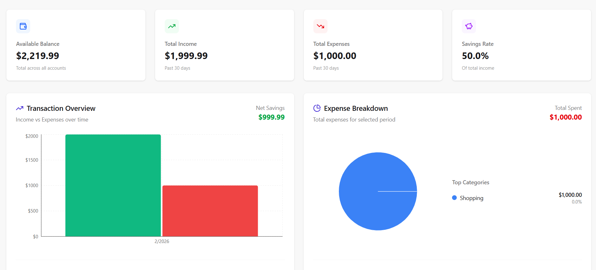
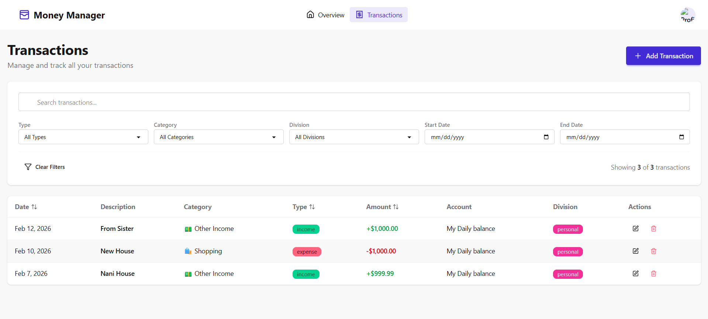

# 💰 Money Manager

A comprehensive personal finance management application built with React and Node.js. Track your income, expenses, and transfers with ease while gaining insights into your spending habits.


---

## 📸 Screenshots

### Dashboard

*Track your financial overview with interactive charts and real-time data*

### Transactions

*Manage all your transactions with advanced filtering and search*

### Add Transaction

*Easy-to-use sidebar for adding and editing transactions*

---

## ✨ Features

### 🎯 Core Features
- **Dashboard Analytics**
  - Real-time financial overview
  - Income vs Expense tracking
  - Savings rate calculation
  - Interactive charts and graphs
  - Category-wise expense breakdown

- **Transaction Management**
  - Add, edit, and delete transactions
  - Support for Income, Expense, and Transfer types
  - 12-hour edit window for transaction modifications
  - Automatic account balance updates

- **Smart Categorization**
  - 19 pre-defined categories (5 income, 14 expense)
  - Custom category creation
  - Category-based filtering and analytics
  - Icon and color customization

- **Multi-Account Support**
  - Multiple account management (Savings, Checking, Credit, Cash, Investment)
  - Account-to-account transfers
  - Real-time balance tracking
  - Account-wise transaction history

- **Advanced Filtering**
  - Search transactions by description
  - Filter by type, category, account, and division
  - Date range filtering
  - Real-time results

- **Division Tracking**
  - Separate personal and office expenses
  - Division-based analytics
  - Easy switching between divisions

### 🔐 Security Features
- JWT-based authentication
- Secure password hashing with bcrypt
- Protected API routes
- User data isolation
- Session management

### 📊 Analytics & Reporting
- Monthly/Weekly/Yearly trends
- Category-wise spending analysis
- Income vs Expense comparison
- Savings rate tracking
- Transaction overview charts
- Expense breakdown pie charts

---

## 🛠️ Tech Stack

### Frontend
- **React 18** - UI library
- **React Router** - Navigation
- **Zustand** - State management
- **React Hook Form** - Form handling
- **Recharts** - Data visualization
- **Lucide React** - Icons
- **DaisyUI** - UI components
- **Tailwind CSS** - Styling
- **Axios** - HTTP client
- **React Hot Toast** - Notifications

### Backend
- **Node.js** - Runtime environment
- **Express.js** - Web framework
- **MongoDB** - Database
- **Mongoose** - ODM
- **JWT** - Authentication
- **bcryptjs** - Password hashing
- **CORS** - Cross-origin resource sharing

### Backend Repository & API
- **Backend Repository**: [https://github.com/VikaSh221525/money-manager-backend](https://github.com/VikaSh221525/money-manager-backend)
- **Live API**: [https://money-manager-backend.onrender.com](https://money-manager-backend.onrender.com)

---

## 🚀 Getting Started

### Prerequisites
- Node.js (v18 or higher)
- MongoDB (v6 or higher)
- npm or yarn

### Installation

1. **Clone the repository**
```bash
git clone https://github.com/yourusername/money-manager.git
cd money-manager
```

2. **Install Frontend Dependencies**
```bash
npm install
```

3. **Install Backend Dependencies**
```bash
cd backend
npm install
```

4. **Environment Setup**

Create a `.env` file in the root directory:
```env
VITE_API_URL=http://localhost:3000/api
```

**For Production (using live backend):**
```env
VITE_API_URL=https://money-manager-backend.onrender.com/api
```

**Backend Repository**: The backend code is available at [https://github.com/VikaSh221525/money-manager-backend](https://github.com/VikaSh221525/money-manager-backend)

If you want to run the backend locally, clone the backend repository:
```bash
git clone https://github.com/VikaSh221525/money-manager-backend.git
cd money-manager-backend
npm install
```

Create a `.env` file in the backend directory:
```env
PORT=3000
MONGODB_URI=mongodb://localhost:27017/money-manager
JWT_SECRET=your_jwt_secret_key_here
NODE_ENV=development
```

5. **Start MongoDB** (Only if running backend locally)
```bash
# Make sure MongoDB is running
mongod
```

6. **Start Backend Server** (Only if running backend locally)
```bash
cd money-manager-backend
npm run dev
```

**Note**: You can skip steps 5-6 if you're using the live API at `https://money-manager-backend.onrender.com`

7. **Start Frontend Development Server**
```bash
npm run dev
```

8. **Open your browser**
```
http://localhost:5173
```

---

## 📁 Project Structure

```
money-manager/
├── public/                  # Static assets
├── src/
│   ├── Components/         # React components
│   │   ├── accounts/      # Account-related components
│   │   ├── categories/    # Category components
│   │   ├── common/        # Shared components (Navbar, Loader)
│   │   ├── dashboard/     # Dashboard components
│   │   └── transactions/  # Transaction components
│   ├── pages/             # Page components
│   │   ├── Dashboard.jsx
│   │   ├── TransactionsPage.jsx
│   │   ├── LoginPage.jsx
│   │   └── SignUpPage.jsx
│   ├── routes/            # Route configuration
│   ├── store/             # Zustand stores
│   │   ├── authStore.js
│   │   ├── accountStore.js
│   │   ├── categoryStore.js
│   │   ├── transactionStore.js
│   │   └── dashboardStore.js
│   ├── utils/             # Utility functions
│   ├── App.jsx            # Main App component
│   └── main.jsx           # Entry point
├── backend/
│   ├── controllers/       # Route controllers
│   ├── models/            # Mongoose models
│   ├── routes/            # API routes
│   ├── middleware/        # Custom middleware
│   └── server.js          # Server entry point
└── README.md
```

---

## 🎨 Key Components

### Dashboard
- **SummaryCards**: Display key financial metrics
- **TransactionOverviewChart**: Bar chart showing income vs expenses
- **ExpenseBreakdownChart**: Pie chart for category-wise expenses
- **RecentTransactions**: List of latest transactions

### Transactions
- **TransactionsPage**: Complete transaction management interface
- **AddTransactionSidebar**: Form for adding/editing transactions
- **Search & Filters**: Advanced filtering capabilities

### Accounts
- **CreateAccountModal**: Modal for creating new accounts
- **Account Management**: View and manage multiple accounts

---

## 🔑 API Endpoints

### Authentication
```
POST   /api/auth/signup      - Register new user
POST   /api/auth/login       - User login
POST   /api/auth/logout      - User logout
GET    /api/auth/me          - Get current user
```

### Transactions
```
POST   /api/transactions     - Create transaction
GET    /api/transactions     - Get all transactions (with filters)
PUT    /api/transactions/:id - Update transaction
DELETE /api/transactions/:id - Delete transaction
```

### Categories
```
POST   /api/categories/initialize - Initialize default categories
GET    /api/categories            - Get all categories
POST   /api/categories            - Create category
PUT    /api/categories/:id        - Update category
DELETE /api/categories/:id        - Delete category
GET    /api/categories/summary    - Get category summary
```

### Accounts
```
POST   /api/accounts         - Create account
GET    /api/accounts         - Get all accounts
GET    /api/accounts/:id     - Get account details
PUT    /api/accounts/:id     - Update account
DELETE /api/accounts/:id     - Delete account
```

### Dashboard
```
GET    /api/dashboard/summary   - Get dashboard summary
GET    /api/dashboard/trends    - Get income/expense trends
GET    /api/dashboard/accounts  - Get accounts overview
```

---

## 💡 Usage Guide

### Adding Your First Transaction

1. **Create an Account**
   - Click "Create Account" button
   - Enter account name and initial balance
   - Select account type (Savings, Checking, etc.)

2. **Add a Transaction**
   - Click "Add Transaction" button
   - Select transaction type (Income/Expense/Transfer)
   - Fill in the details:
     - Title/Description
     - Amount
     - Category
     - Account
     - Division (Personal/Office)
     - Date & Time
   - Click "Save"

3. **View Analytics**
   - Navigate to Dashboard
   - View your financial overview
   - Analyze spending by category
   - Track income vs expenses

### Managing Transactions

- **Edit**: Click the edit icon (✏️) on any transaction
- **Delete**: Click the delete icon (🗑️) - only available within 12 hours
- **Search**: Use the search bar to find specific transactions
- **Filter**: Apply filters by type, category, division, or date range

---

## 🎯 Default Categories

### Income Categories (5)
- 💰 Salary
- 💻 Freelance
- 📈 Investment
- 🏢 Business
- 💵 Other Income

### Expense Categories (14)
- 🍽️ Food
- ⛽ Fuel
- 🎬 Movie
- 🏥 Medical
- 🏦 Loan
- 🛍️ Shopping
- 🚗 Transport
- 💡 Utilities
- 🏠 Rent
- 📚 Education
- 🎮 Entertainment
- ✈️ Travel
- 🛡️ Insurance
- 💸 Other Expense

---

## 🔒 Security Best Practices

- Passwords are hashed using bcrypt with salt rounds
- JWT tokens for secure authentication
- Protected routes with authentication middleware
- User data isolation - users can only access their own data
- Input validation on both frontend and backend
- CORS configuration for API security

---

## 🐛 Known Issues & Limitations

- Transactions can only be edited/deleted within 12 hours of creation
- Date range filters use local timezone
- Maximum 200 characters for transaction descriptions
- Category names limited to 30 characters

---

## 🚧 Future Enhancements

- [ ] Budget planning and alerts
- [ ] Recurring transactions automation
- [ ] Export data to CSV/PDF
- [ ] Multi-currency support
- [ ] Mobile app (React Native)
- [ ] Bill reminders and notifications
- [ ] Receipt attachment support
- [ ] Advanced reporting with custom date ranges
- [ ] Goal tracking and savings targets
- [ ] Bank account integration
- [ ] Dark mode support
- [ ] Multi-language support

---

## 🤝 Contributing

Contributions are welcome! Please feel free to submit a Pull Request.

1. Fork the project
2. Create your feature branch (`git checkout -b feature/AmazingFeature`)
3. Commit your changes (`git commit -m 'Add some AmazingFeature'`)
4. Push to the branch (`git push origin feature/AmazingFeature`)
5. Open a Pull Request

---

## 👨‍💻 Author

**Your Name**
- GitHub: [@VikaSh221525](https://github.com/yourusername)
- LinkedIn: [Yvikash-sharma-8641b033b](https://linkedin.com/in/yourprofile)
- Email: its.vikashsharma212@gmail.com

---

## 🙏 Acknowledgments

- [React](https://reactjs.org/) - The web framework used
- [DaisyUI](https://daisyui.com/) - UI component library
- [Recharts](https://recharts.org/) - Charting library
- [Lucide](https://lucide.dev/) - Icon library
- [MongoDB](https://www.mongodb.com/) - Database

---

## 📞 Support

If you have any questions or need help, please:
- Open an issue on GitHub
- Email: support@moneymanager.com
- Join our Discord community

---

## ⭐ Show Your Support

Give a ⭐️ if this project helped you!

---

<div align="center">
  <p>Made with ❤️ for better financial management</p>
  <p>© 2026 Money Manager. All rights reserved.</p>
</div>
